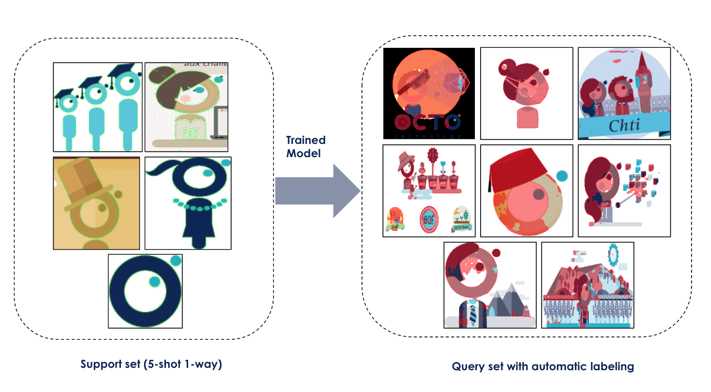
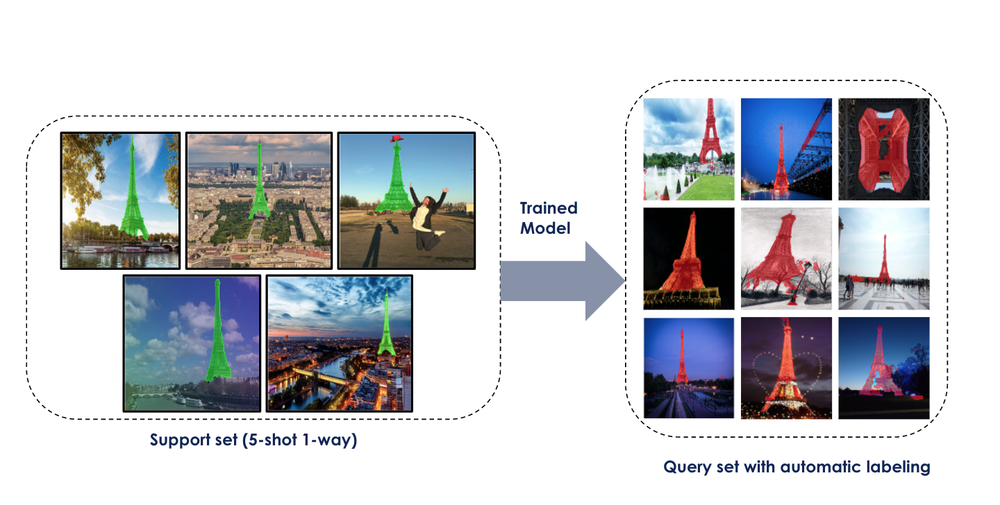

# Few-Shot Learning for Image Segmentation

Inspired repository from the [FSS-1000 paper](https://arxiv.org/abs/1907.12347). This is a metric-learning and meta-learning solution to segment a dataset of labeled images using only few number of images per class.

## Environment setup 
1) First, set-up the conda environment with python >=3.7 
2) Activate the new envirnment 
```
conda activate new_env python=3.7
```
3) Install the required packages:
```
pip install requirements.txt
```
or 
```
conda install requirements.txt
```
## Datasets
- FSS-1000: [download here](https://drive.google.com/open?id=16TgqOeI_0P41Eh3jWQlxlRXG9KIqtMgI)
- Pascal-5i: The pascal5i dataset is generated from the dataset Pascal VOC 2012 ([link to download](http://host.robots.ox.ac.uk/pascal/VOC/)) using [**this script**](https://github.com/DeepTrial/pascal-5). It is constituted by 4 batches (0,1,2,3) and each batch contains 5 differents classes and hundreds of images. The train and test sets for each batch are the same in this case. No need to resplit the dataset, we will use it in the same way as in the litterature and the original paper [**OSLSM**](https://arxiv.org/abs/1709.03410).
- Other datasets: Eiffel, octo, chest -- coming soon ...

## Getting Started
### Training 
Training on 500,000 episodes for the 1-way 5-shot segmentation using the FSS-1000 dataset.
```
python -m src.entrypoints.train -episode 500000 --result-save-freq 50000 --model-save-freq 50000 --use-gpu True -lr 0.001 -K 5 -N 1 -batch 1 --model-save-path 'relation_network_trained' --train-result-path 'results_predicted_images_masks' --load-imagenet True --train-data-path 'data/train/'
```


### Testing
#### Testing on FSS-1000
In this phase , we will evaluate the images of the test set using the meanIoU metric which calculates the average internsection over union between the gound truth mask and the predicted mask per class.
```
python -m src.entrypoints.evaluate_predict --save-episode 499999 -K 5 -N 1 -batch 1 --use-gpu True --data-name "FSS" --pascal-batch None --result-dir results_predicted_images_masks --test-dir 'data/test/'
```
#### Testing on Pascal-5i
In the same way, we can test on several batches of pascal (0,1,2,3)
```
python -m src.entrypoints.evaluate_predict --save-episode 499999 -K 5 -N 1 -batch 1 --use-gpu True --data-name "pascal-5i" --pascal-batch 1 --result-dir results_predicted_images_masks --test-dir 'data_pascal5i/1/test/'
```
### Application to pre-labeling
```
 python -m src.entrypoints.entrypoint_autolabel -K 5 -N 1 -batch 1 --model-save-path 'models'  -sd 'imgs/example/support' -td 'imgs/example/query' --result-dir 'result' --use-gpu True -encoder 'relation_network_trained/feature_encoder_499999_1_way_5shot.pkl'   -network 'relation_network_trained/relation_network_499999_1_way_5shot.pkl'

```

### Examples: results on pre-labeling



